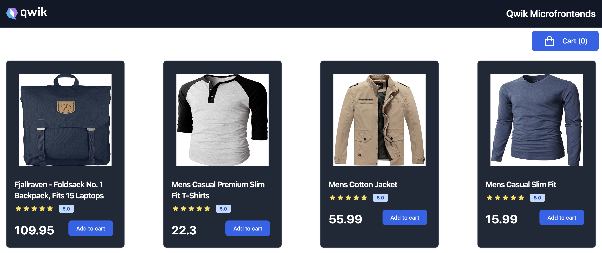
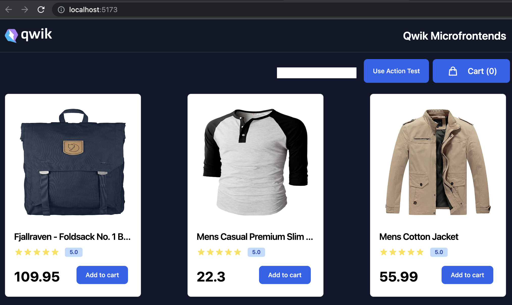
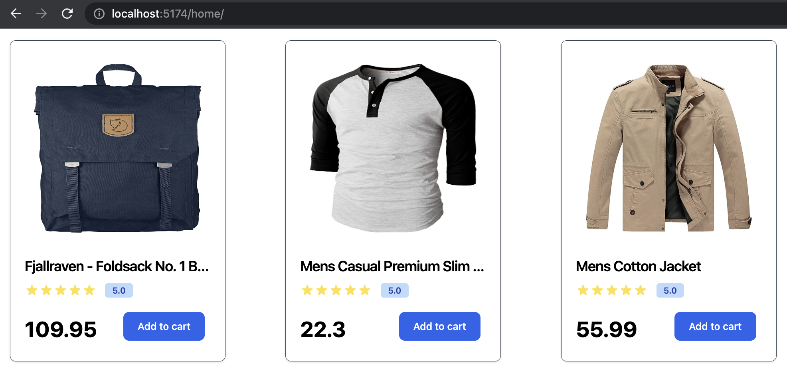
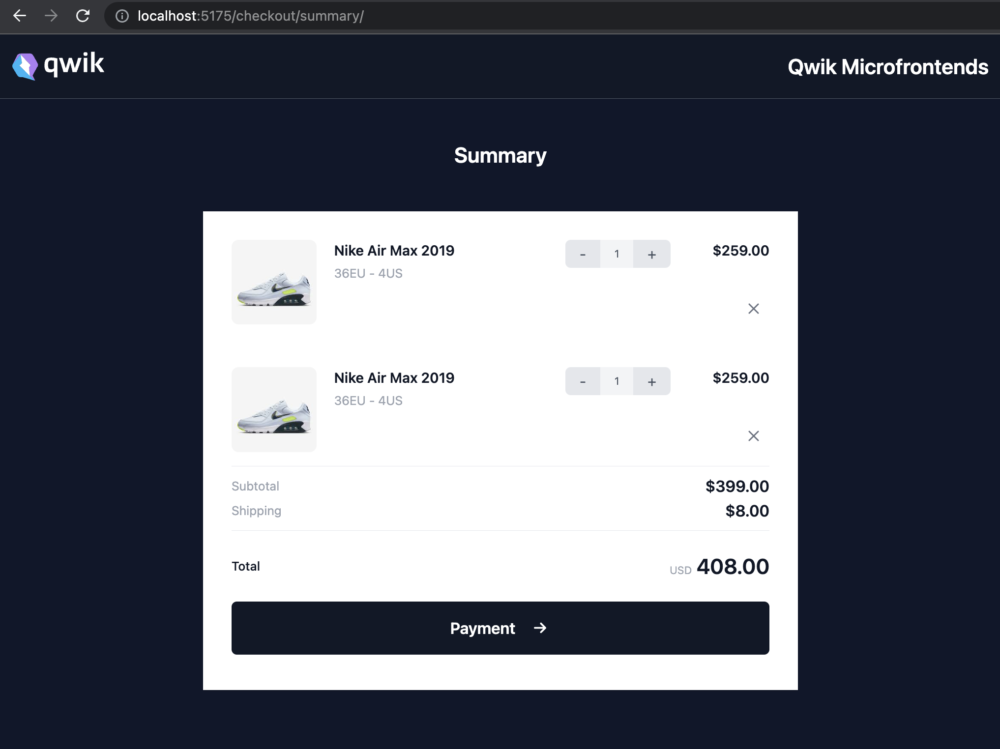
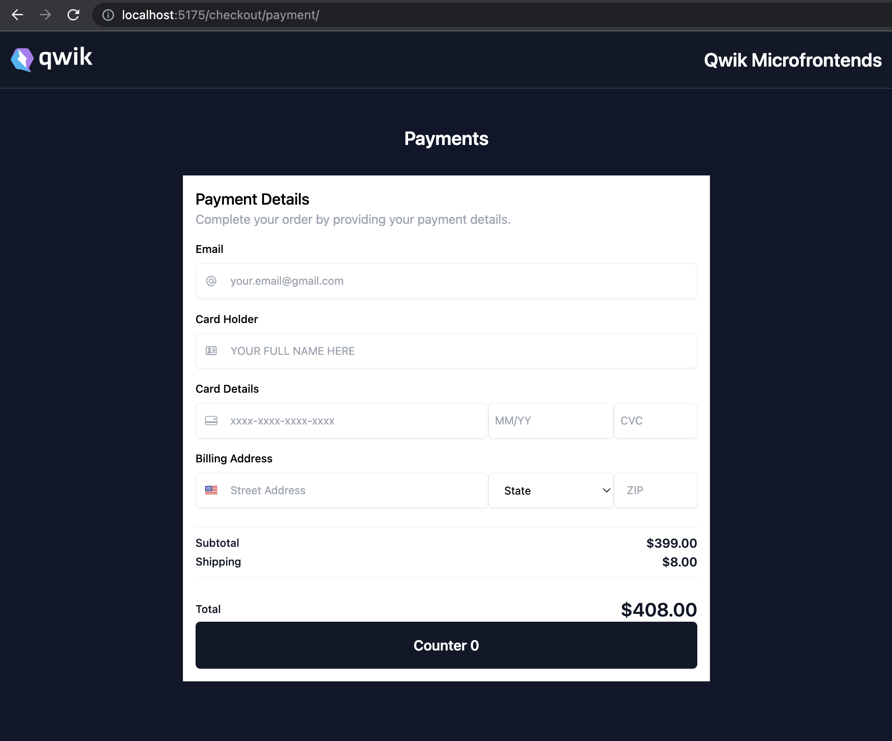

# Qwik Microfrontends

node >= v18.10.0 required

## The project contains 3 apps ( Host, Home, Checkout )

### Host

port: 5173

### Home ( horizontal split )

port: 5174

### Checkout ( vertical split with multiple routes )

port: 5175

#### route: /checkout/summary/

#### route: /checkout/payment/

## Startup project

From the root install all the dependencies `pnpm i`

## Preview server

- `npm run preview`

## Development server

Run `npm run dev` to run a dev server for each application.

At http://localhost:5173 you can open the host and see the working application.
